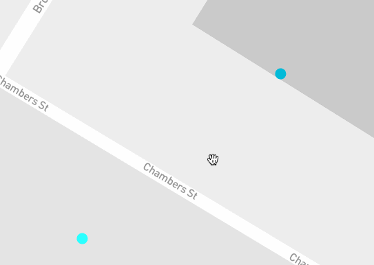
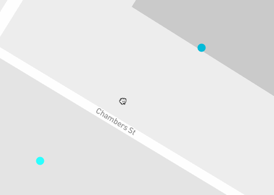

# react-map-gl-stack-gl-overlay-example

An experiment in using stackGL in a
[react-map-gl](https://github.com/uber/react-map-gl) overlay.


This demo uses data from http://www.andresmh.com/nyctaxitrips/

## Usage

````js
    render: function render() {
      return <MapGL ...viewportProps>
        <ExampleOverlay
          latitude={viewportProps.latitude}
          longitude={viewportProps.longitude}
          zoom={viewportProps.zoom}
          locations={locations} />
      </MapGL>;
    }
````

## Experiment: Passing tile coordinates to the GPU

This has evolved into a larger experiment in passing tile coordinates to the GPU
as a performance optimization. We represent each tile coordinate as a double
using two float values and use helper functions originaly from [Andrew Thall](http://andrewthall.org/)'s
[Extended-Precision Floating-Point Numbers for GPU Computation](http://andrewthall.org/papers/df64_qf128.pdf).
However, there currently are issues with implementing `df64mult` that is causing
jitter while zooming at hi zoom levels but panning works well.


Panning demo



Zomming jitter demo


This might be caused by the GLSL compiler optimizing away things like `float ahi = t - (t - a);`.  This idea was original mentioned by [Mikael Hvidtfeldt Christensen](http://blog.hvidtfeldts.net/index.php/about/) in his [Double Precision in OpenGL and WebGL](http://blog.hvidtfeldts.net/index.php/2012/07/double-precision-in-opengl-and-webgl/).

But interestingly, if we replace `float ahi = t - (t - a);` with `float ahi = -a;`, we slightly more jitter.



## To install

    npm install

## To run

    npm run start
