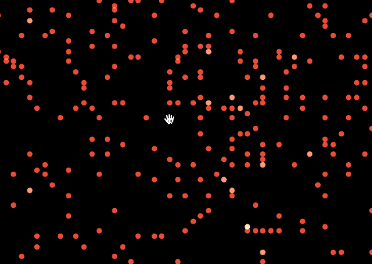

# react-map-gl-stack-gl-overlay-example

An experiment in using stackGL in a
[react-map-gl](https://github.com/uber/react-map-gl) overlay.



This demo uses data from http://www.andresmh.com/nyctaxitrips/

## Usage

````js
    render: function render() {
      return <MapGL ...viewportProps>
        <ExampleOverlay
          latitude={viewportProps.latitude}
          longitude={viewportProps.longitude}
          zoom={viewportProps.zoom}
          locations={cities} />
      </MapGL>;
    }
````